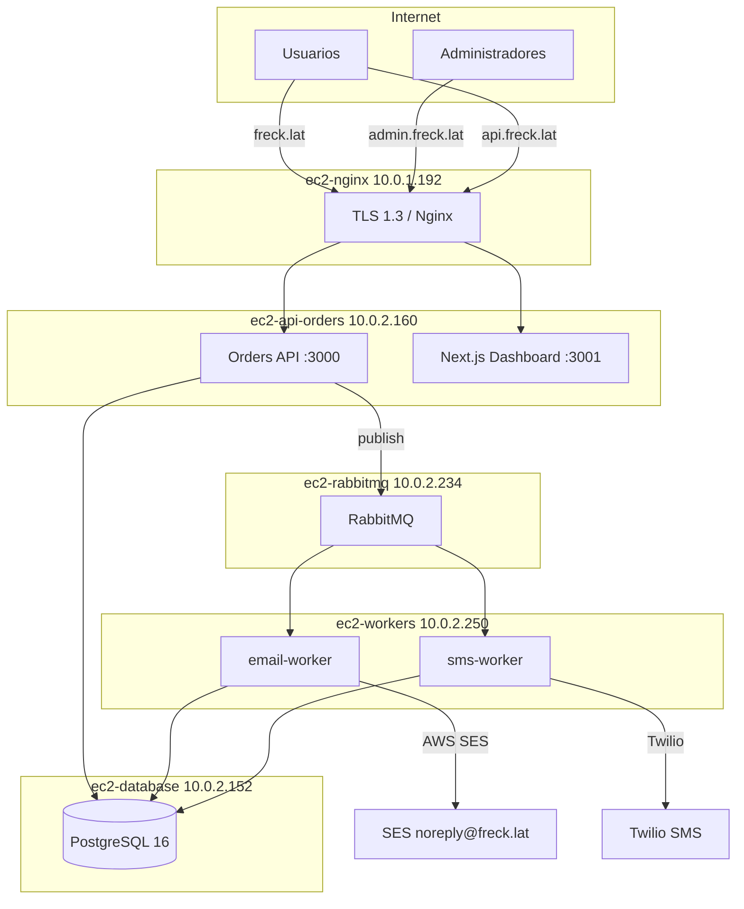
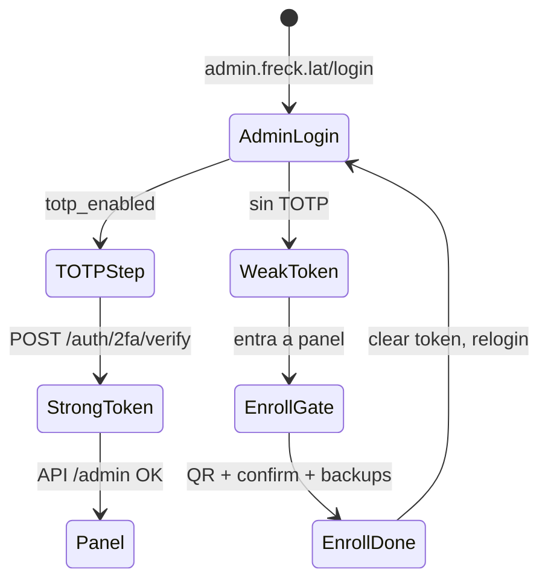

# Reporte completo — Sistema de Notificaciones E-Commerce (Grupo 2)

**Proyecto:** Sistema de Notificaciones para E-Commerce con Cola de Mensajes  
**Dominio en producción:** `freck.lat` · `api.freck.lat` · `admin.freck.lat`  
**Repositorio:** https://github.com/riverbonilla1504/pow  
**Última actualización del reporte:** Mayo 2026  

---

## 1. Origen del proyecto y problema a resolver

### 1.1 Enunciado académico

Una tienda online genera eventos de negocio (compra, envío, devolución). Esos eventos deben enrutarse mediante **RabbitMQ** hacia microservicios de notificación (email y SMS), sin bloquear la API de órdenes si un worker falla.

Requisitos transversales del entregable:

| Área | Requisito |
|------|-----------|
| **EC2** | Instancias separadas: Nginx, API, RabbitMQ, Workers, Base de datos. Aislamiento: comprometer la web no implica acceso directo a DB ni al bus. |
| **RabbitMQ** | Exchange tipo **topic**, **DLQ**, **persistencia** de mensajes. |
| **nftables** | RabbitMQ estrictamente privado; solo tráfico desde la VPC interna. |
| **Nginx** | TLS 1.3, bloqueo de métodos HTTP no usados. |
| **JWT** | Claims por rol: `cliente`, `operador`, `admin`. |
| **SQL Injection** | Auditoría con sqlmap (modo safe) y corrección de hallazgos. |
| **2FA** | Enrolamiento, verificación en login y recuperación con códigos de respaldo. |
| **Entregables** | Repositorio, scripts de despliegue, reporte de configuración de seguridad. |

### 1.2 Problema operativo que motivó el trabajo reciente (portales web)

Tras desplegar el dashboard Next.js en un solo proceso (`:3001`), la intención era:

- **`freck.lat`** → portal de **usuarios** (landing, registro, login, mis órdenes).
- **`admin.freck.lat`** → portal de **administración** (panel, DLQ, usuarios, 2FA obligatorio).

**Síntoma:** al entrar en `admin.freck.lat`, el navegador terminaba en el login de **usuarios** en `freck.lat/login`, con branding y flujo de cliente.

**Causas identificadas en código (antes de la corrección):**

1. El layout admin redirigía explícitamente a `https://freck.lat/login` si no había JWT.
2. No existía ruta de login propia bajo `app/admin/`.
3. La cookie `token` es **por host** (sin `Domain=.freck.lat`): un login en `freck.lat` no servía en `admin.freck.lat`.
4. Tras login, todos los usuarios iban a `/dashboard` sin distinguir portal admin.

**Solución implementada:** portales separados con sesiones independientes, login/2FA/recuperación en cada dominio, y route groups `(public)` / `(protected)` en Next.js. Detalle en la sección 8.

---

## 2. Arquitectura general (estado actual)



### 2.1 Flujo de un evento de orden

1. Cliente autenticado crea orden → `POST /orders` (API).
2. API persiste en PostgreSQL y publica en exchange `order.events` (topic, durable).
3. Bindings enrutan por routing key, por ejemplo `order.created.email` → cola `q.notify.email`.
4. `email-worker` o `sms-worker` consume, envía notificación y registra en `notification_logs`.
5. Si falla tras **3 reintentos**, el mensaje va a **DLQ** (`q.dead.letter` vía `dlx.exchange`).
6. Admin consulta DLQ y logs desde `admin.freck.lat`.

**SMS de alto valor:** órdenes con `total > 500` y teléfono registrado publican además `order.created.sms`.

### 2.2 Routing keys configurados

| Routing key | Cola | Canal |
|-------------|------|--------|
| `order.created.email` | `q.notify.email` | Email (creación) |
| `order.shipped.email` | `q.notify.email` | Email (envío) |
| `order.returned.email` | `q.notify.email` | Email (devolución) |
| `order.*.sms` | `q.notify.sms` | SMS (patrón topic) |

Implementación: `ec2-api-orders/src/services/rabbitmq.js`.

---

## 3. Infraestructura EC2

| Instancia | IP privada | IP pública / rol | Servicios |
|-----------|------------|------------------|-----------|
| **ec2-nginx** | 10.0.1.192 | 52.21.124.113 (bastion) | Nginx, TLS, único punto HTTP(S) desde Internet |
| **ec2-api-orders** | 10.0.2.160 | — | API Node `:3000`, Dashboard Next.js `:3001`, PM2 |
| **ec2-rabbitmq** | 10.0.2.234 | — | RabbitMQ AMQP `:5672`, management `:15672` (solo VPC) |
| **ec2-workers** | 10.0.2.250 | — | `email-worker`, `sms-worker` (PM2) |
| **ec2-database** | 10.0.2.152 | — | PostgreSQL 16 (`5432` desde API `10.0.2.160` y workers `10.0.2.250`) |

Las instancias `10.0.2.x` están en subred privada **sin acceso directo desde Internet**. Administración SSH vía bastion:

```bash
ssh -i pow.pem -o ProxyCommand="ssh -i pow.pem ubuntu@52.21.124.113 -W %h:%p" ubuntu@<IP_PRIVADA>
```

**Principio de aislamiento:** un atacante que comprometa Nginx o el dashboard aún debe saltar reglas de firewall y credenciales para llegar a RabbitMQ, PostgreSQL o workers en otras VMs.

---

## 4. Componentes del repositorio

```
pow/
├── ec2-nginx/          # Nginx + nftables bastion
├── ec2-api-orders/     # API REST + publicador RabbitMQ
├── ec2-dashboard/      # Next.js 16 (freck.lat + admin.freck.lat)
├── ec2-rabbitmq/       # Setup RabbitMQ + nftables
├── ec2-workers/        # Consumidores email/SMS
├── ec2-database/       # Migraciones SQL + setup
├── common/             # Scripts compartidos (nftables)
├── deploy.sh           # Despliegue genérico por componente
├── login2fa_admin/     # Documentación plan login/2FA
├── CLAUDE.md           # Guía operativa del equipo
└── REPORTE_SISTEMA_NOTIFICACIONES_GRUPO2.md  # Este documento
```

---

## 5. API de órdenes (`ec2-api-orders`)

### 5.1 Stack y proceso

- **Runtime:** Node.js + Express  
- **PM2:** proceso `orders-api`  
- **Puerto:** 3000 (solo accesible desde nginx vía nftables)  
- **Seguridad HTTP:** Helmet, CORS explícito, rate limit global (100 req / 15 min), rate limit login (5 / 15 min)

### 5.2 Endpoints

**Salud**

| Método | Ruta | Auth |
|--------|------|------|
| GET | `/health` | No |

**Autenticación** (`/auth`)

| Método | Ruta | Descripción |
|--------|------|-------------|
| POST | `/auth/register` | Registro cliente (rol por defecto `cliente`) |
| POST | `/auth/login` | Login; si `totp_enabled` → `tempToken` + `requires2FA` |
| GET | `/auth/me` | Perfil + `totp_enabled` (JWT requerido) |
| POST | `/auth/2fa/verify` | Completa login con código TOTP |
| POST | `/auth/2fa/enroll` | Genera secreto + QR |
| POST | `/auth/2fa/confirm` | Activa TOTP + devuelve 8 backup codes |
| POST | `/auth/2fa/recover` | Recuperación con email + password + backup code |

**Órdenes** (`/orders`, JWT requerido)

| Método | Ruta | Roles |
|--------|------|-------|
| GET | `/orders` | Cliente: propias; operador/admin: listado amplio |
| GET | `/orders/:id` | Cliente: solo propia |
| POST | `/orders` | Autenticado; publica eventos RabbitMQ |
| PATCH | `/orders/:id/status` | `operador`, `admin` |

**Administración** (`/admin`, JWT + rol `admin` + `require2FA`)

| Método | Ruta | Descripción |
|--------|------|-------------|
| GET | `/admin/dashboard` | Métricas agregadas |
| GET | `/admin/orders` | Órdenes paginadas/filtradas |
| GET | `/admin/notifications` | Logs de notificaciones |
| GET | `/admin/dlq` | Mensajes en dead-letter queue |
| GET | `/admin/users` | Usuarios |
| PATCH | `/admin/users/:id/role` | Cambio de rol |

### 5.3 JWT (RS256)

- Claves: `keys/private.pem`, `keys/public.pem` (no en git; solo en servidor).
- Claims típicos: `sub`, `email`, `role`, `permissions[]`, `twoFactorVerified` (boolean).
- Roles y permisos definidos en `ROLE_PERMISSIONS` dentro de `auth.js`.
- Middleware `require2FA`: rutas `/admin/*` exigen `twoFactorVerified: true` en el token.

### 5.4 Prevención de inyección SQL

Las consultas usan **parámetros posicionales** (`$1`, `$2`, …) vía `pg`, no concatenación de strings con input del usuario.

**Requisito del enunciado (sqlmap):** la auditoría con sqlmap en modo safe debe ejecutarse contra `api.freck.lat` y documentarse aparte; no hay artefactos sqlmap en el repositorio al momento de este reporte. Se recomienda adjuntar capturas o log de ejecución al entregar el proyecto.

---

## 6. RabbitMQ (`ec2-rabbitmq`)

### 6.1 Configuración lógica

| Recurso | Tipo | Detalle |
|---------|------|---------|
| `order.events` | topic exchange | Durable; publicación desde API |
| `dlx.exchange` | fanout | Dead-letter exchange |
| `q.notify.email` | queue | DLX + TTL 30s |
| `q.notify.sms` | queue | DLX + TTL 30s |
| `q.dead.letter` | queue | Mensajes fallidos definitivos |

Mensajes publicados con `persistent: true`.

### 6.2 Seguridad de red (nftables)

Archivo: `ec2-rabbitmq/nftables.conf`

- Política **drop** por defecto.
- AMQP `5672` solo desde `10.0.2.160` (API) y `10.0.2.250` (workers).
- SSH solo desde bastion `10.0.1.192`.
- **No** hay reglas que expongan RabbitMQ a Internet.

### 6.3 Setup

Script `ec2-rabbitmq/setup.sh`: instala RabbitMQ, crea usuario `ecommerce`, elimina `guest`, habilita plugin de management (acceso restringido por firewall).

---

## 7. Workers de notificación (`ec2-workers`)

### 7.1 Email worker

- Cola: `q.notify.email`
- Proveedor: **AWS SES** (`noreply@freck.lat`, dominio verificado con DKIM en `us-east-1`)
- Plantillas: `order_created`, `order_shipped`, `order_returned`
- Reintentos: hasta 3; luego `nack` → DLQ
- PM2: `email-worker`

### 7.2 SMS worker

- Cola: `q.notify.sms`
- Proveedor: **Twilio** (integración en producción verificada)
- Caso principal: `high_value_order` (órdenes > $500)
- PM2: `sms-worker`

### 7.3 Persistencia de resultados

`ec2-workers/src/db.js` inserta en tabla `notification_logs` (estado `sent` / `failed`, destinatario, template, error).

### 7.4 nftables workers

`ec2-workers/nftables.conf`: SSH solo desde bastion; sin puertos de servicio expuestos hacia Internet (workers inician conexiones salientes a RabbitMQ y APIs externas).

---

## 8. Frontend — Dashboard Next.js (`ec2-dashboard`)

### 8.1 Despliegue

- **Framework:** Next.js 16.2 (App Router, Turbopack)
- **Puerto:** 3001 en `ec2-api-orders`
- **PM2:** proceso `dashboard`
- **Build:** `npm run build` antes de `pm2 restart dashboard`

### 8.2 Enrutamiento por dominio (`proxy.ts`)

| Condición | Acción |
|-----------|--------|
| Host `admin.*` y ruta no empieza con `/admin` | Rewrite interno → `/admin/...` (ej. `/login` → `/admin/login`) |
| Host no admin y ruta `/admin/*` | Redirect 302 → `https://admin.freck.lat/` |

### 8.3 Portal usuario — `freck.lat`

| Ruta | Función |
|------|---------|
| `/` | Landing (arquitectura del sistema, features) |
| `/login` | Login + paso 2FA si aplica |
| `/login/recover` | Recuperación con backup code |
| `/register` | Registro |
| `/dashboard` | Mis órdenes, crear orden, stats |
| `/settings/security` | Activar 2FA opcional (QR, confirm, backup codes) |

Cookie `token` solo en host `freck.lat`. Enlace a seguridad desde icono escudo en nav del dashboard.

### 8.4 Portal admin — `admin.freck.lat`

Estructura de carpetas:

```
app/admin/
  layout.tsx                 # Passthrough
  (public)/
    login/page.tsx           # Login solo rol admin
    login/recover/page.tsx   # Recuperación 2FA
  (protected)/
    layout.tsx               # Guard: JWT + admin + twoFactorVerified
    page.tsx                 # Dashboard métricas
    orders/                  # Gestión órdenes
    notifications/           # Logs
    dlq/                     # Dead Letter Queue
    users/                   # Roles
```

**Flujo 2FA admin (obligatorio):**



- Sin token → redirect relativo `/login` (permanece en admin).
- Rol distinto de `admin` → pantalla “Acceso denegado” + enlace a freck.lat.
- Sin `twoFactorVerified` → componente `TwoFactorEnroll` (gate).
- Logout sidebar → `/login` en admin (cookie borrada solo en ese host).

### 8.5 Componentes UI compartidos (post-refactor)

| Componente | Ruta |
|------------|------|
| `AuthShell` | Layout centrado auth (variant user/admin) |
| `PageHeader` | Títulos panel admin |
| `TwoFactorEnroll` | Enrolamiento QR + backups |
| `RecoverForm` | Recuperación backup codes |
| `FormField` | Inputs consistentes |

### 8.6 Diseño

- Fuentes: **DM Sans** (cuerpo), **IBM Plex Mono** (códigos/IDs)
- Variables CSS: `--bg`, `--green`, `--border`, utilidades `.auth-shell`, `.auth-card`, `.container-page`
- Idioma HTML: `es`

---

## 9. Nginx y TLS (`ec2-nginx`)

Archivo: `sites-available/ecommerce`

| `server_name` | Backend | Uso |
|---------------|---------|-----|
| `freck.lat` | `10.0.2.160:3001` | Dashboard usuario |
| `api.freck.lat` | `10.0.2.160:3000` | API REST |
| `admin.freck.lat` | `10.0.2.160:3001` | Dashboard admin |

**TLS:** solo TLS 1.3; cipher suites `TLS_AES_256_GCM_SHA384`, `TLS_CHACHA20_POLY1305_SHA256`.  
**Certificados:** Let's Encrypt `/etc/letsencrypt/live/freck.lat/`.  
**Headers:** HSTS, X-Frame-Options DENY, X-Content-Type-Options nosniff.  
**Métodos:** lista blanca (`GET`, `POST`, `PUT`, `DELETE`, `PATCH`; API incluye `OPTIONS` para CORS).  
**HTTP:** redirección 301 a HTTPS en puerto 80.

---

## 10. Base de datos (`ec2-database`)

- **Motor:** PostgreSQL 16  
- **Host:** `10.0.2.152:5432`  
- **Base:** `ecommerce`  
- **Usuario aplicación:** `appuser`  

**Tablas principales** (`migrations/001_initial_schema.sql`):

| Tabla | Propósito |
|-------|-----------|
| `users` | Credenciales, rol, TOTP, backup_codes, teléfono |
| `orders` | Órdenes (items JSONB, estado, total) |
| `notifications` | Registro de notificaciones (esquema inicial) |

En producción los workers y el panel admin usan también **`notification_logs`** (creada en despliegue; consultada por API admin y workers).

**Migración manual en servidor:**

```bash
sudo -u postgres psql ecommerce < /home/ubuntu/pow/ec2-database/migrations/001_initial_schema.sql
```

---

## 11. Seguridad — Resumen de configuración

### 11.1 nftables (deny-by-default)

| Instancia | Regla destacada |
|-----------|-----------------|
| nginx | 22, 80, 443 desde Internet |
| api-orders | 22, 3000, 3001 solo desde `10.0.1.192` |
| rabbitmq | 5672 solo API + workers; sin Internet |
| workers / database | SSH solo bastion; DB desde API y workers (nftables + SG) |

Aplicación:

```bash
sudo cp /home/ubuntu/pow/<component>/nftables.conf /etc/nftables.conf
sudo systemctl restart nftables
```

Recuperación si se bloquea SSH: **AWS SSM** (`AmazonSSMManagedInstanceCore` en rol EC2).

### 11.2 Autenticación y 2FA

| Aspecto | Implementación |
|---------|----------------|
| Algoritmo JWT | RS256 |
| 2FA | TOTP (speakeasy) + QR (qrcode) |
| Backup codes | 8 códigos hex, hash bcrypt en `users.backup_codes` |
| Admin API | `authorize('admin')` + `require2FA` |
| Sesiones web | Cookies separadas por host (no compartidas entre subdominios) |
| Login brute-force | Rate limit 5 intentos / 15 min en `/auth/login` |

### 11.3 CORS API

Orígenes permitidos: `https://freck.lat`, `https://admin.freck.lat`, `http://localhost:3001` (desarrollo).

### 11.4 AWS

- **SES:** dominio `freck.lat` verificado; modo sandbox (solo destinatarios verificados).
- **Workers:** credenciales en `.env` en servidor (no en repositorio).

---

## 12. Despliegue y operación

### 12.1 Flujo habitual

1. Desarrollo local en `c:\PROGRAMACION\pow` (o equivalente).
2. `git push origin main` → GitHub.
3. En cada instancia afectada:

```bash
cd /home/ubuntu/pow && git pull origin main
# API:
cd ec2-api-orders && pm2 restart orders-api
# Dashboard (misma VM):
cd ec2-dashboard && npm run build && pm2 restart dashboard
# Workers:
cd ec2-workers && pm2 restart all
```

### 12.2 Script `deploy.sh`

Uso: `./deploy.sh <component>` — clona o hace `git pull`, `npm install --production`, reinicia PM2 si existe.

### 12.3 Variables de entorno

No versionadas. Plantillas: `ec2-api-orders/.env.example`, `ec2-workers/.env.example`.  
En servidor: `/home/ubuntu/pow/<component>/.env`.

---

## 13. Cumplimiento del enunciado (checklist)

| Requisito | Estado | Evidencia en repo / producción |
|-----------|--------|--------------------------------|
| EC2 multi-instancia | Cumplido | 5 roles; tabla sección 3 |
| Aislamiento red | Cumplido | Subred privada + nftables por host |
| RabbitMQ topic | Cumplido | `order.events` + routing keys |
| DLQ | Cumplido | `dlx.exchange`, `q.dead.letter`, panel admin |
| Persistencia mensajes | Cumplido | `durable: true` en exchanges/colas y publish |
| nftables RabbitMQ privado | Cumplido | `ec2-rabbitmq/nftables.conf` |
| Nginx TLS 1.3 | Cumplido | `ec2-nginx/sites-available/ecommerce` |
| Bloqueo métodos HTTP | Cumplido | `if ($request_method !~ ...)` en nginx |
| JWT con roles | Cumplido | `auth.js`, `middleware/auth.js` |
| 2FA enrolamiento + recuperación | Cumplido | API + UI user/admin (sección 8) |
| Panel admin con 2FA | Cumplido | Gate + `require2FA` en API |
| API pública protegida | Cumplido | JWT en órdenes; registro/login abiertos |
| Workers desacoplados | Cumplido | Fallo worker no detiene API |
| Repositorio | Cumplido | GitHub `riverbonilla1504/pow` |
| Scripts despliegue | Cumplido | `deploy.sh`, `*/setup.sh` |
| Reporte seguridad | Este documento | `REPORTE_SISTEMA_NOTIFICACIONES_GRUPO2.md` |
| Auditoría sqlmap | Pendiente de evidencia | Consultas parametrizadas; falta log sqlmap en repo |

---

## 14. Cronología de hitos relevantes

| Hito | Descripción |
|------|-------------|
| Infra base | 5 EC2, PostgreSQL, RabbitMQ, API, workers SES/SMS |
| Mensajería | Exchange topic, colas email/SMS, DLQ, reintentos ×3 |
| Seguridad red | nftables deny-by-default, bastion SSH |
| Auth | JWT RS256, roles, TOTP, backup codes |
| Producción web | Next.js en :3001; nginx tres hostnames |
| SMS Twilio | Órdenes > $500 con teléfono |
| Separación portales | Login/2FA/recover admin vs user; cookies por host; `GET /auth/me` |
| Deploy | Commit `9a5bcf4` — build y PM2 en `ec2-api-orders` |

---

## 15. Documentación relacionada en el repositorio

| Archivo | Contenido |
|---------|-----------|
| `CLAUDE.md` | Guía operativa (IPs, PM2, SSH, arquitectura) |
| `login2fa_admin/user.md` | Plan técnico login/2FA y portales |
| `REPORTE_SISTEMA_NOTIFICACIONES_GRUPO2.md` | Este reporte integral |
| `ec2-dashboard/README.md` | Notas del dashboard (si aplica) |

---

## 16. Pruebas recomendadas antes de entrega

1. Crear orden como cliente en `freck.lat` → email en bandeja (SES verificado).
2. Orden > $500 con teléfono → SMS Twilio.
3. Cambiar estado a `shipped` como operador/admin → evento email.
4. Forzar fallo de notificación → mensaje visible en DLQ en admin.
5. Login admin en `admin.freck.lat` → gate 2FA si es primera vez → panel carga métricas.
6. Login cliente en `admin.freck.lat` → mensaje de rol incorrecto.
7. Activar 2FA en `freck.lat/settings/security` → siguiente login pide código.
8. Recuperar con backup code en `/login/recover` (user y admin).
9. Verificar que cookie de `freck.lat` no autentica en `admin.freck.lat`.
10. Ejecutar sqlmap (modo safe) contra endpoints con query params y archivar resultado.

---

## 17. Contacto y dominios

| Recurso | URL |
|---------|-----|
| Tienda / usuarios | https://freck.lat |
| API | https://api.freck.lat |
| Administración | https://admin.freck.lat |
| Health API | https://api.freck.lat/health |

---

*Documento generado para el entregable del Grupo 2 — Sistema de Notificaciones E-Commerce con Cola de Mensajes. Alineado con el enunciado del proyecto, la infraestructura desplegada en AWS EC2 y la implementación de portales separados con 2FA (Mayo 2026).*
