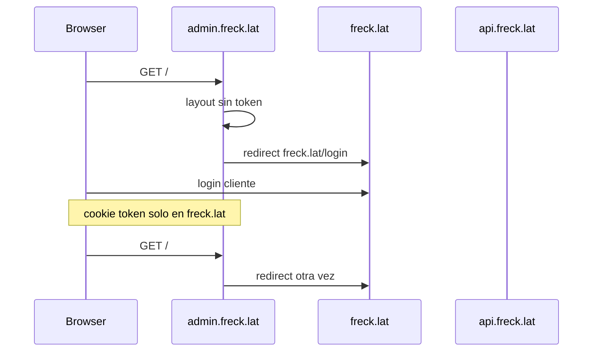
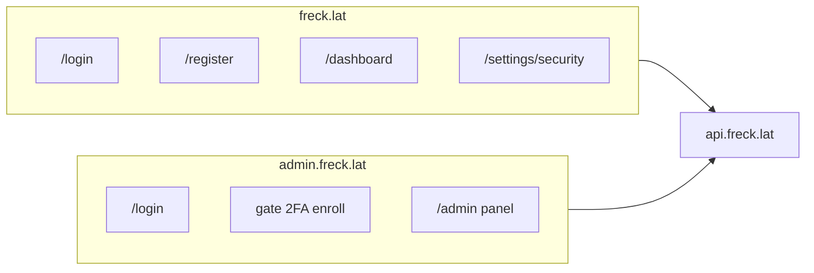
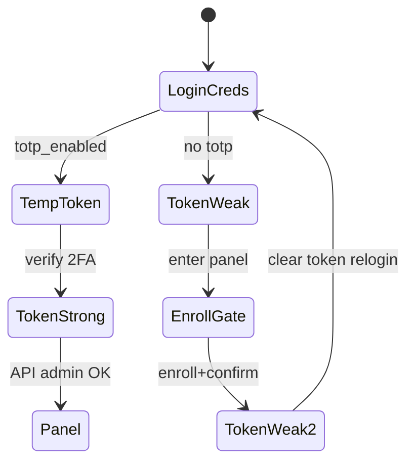

# Plan: Login, 2FA y UI — Usuario vs Admin

**Entregable:** al aprobar, escribir este plan completo en [`login2fa_admin/user.md`](login2fa_admin/user.md).

**Decisiones confirmadas:**
- Cookies **separadas** por host (sin `Domain=.freck.lat`).
- Enrolamiento 2FA admin **obligatorio en gate** del panel (como hoy, pero en `admin.freck.lat`).

---

## Estado actual (problema)



Causas en código:
- [`ec2-dashboard/app/admin/layout.tsx`](ec2-dashboard/app/admin/layout.tsx) redirige a `https://freck.lat/login`.
- No existe `app/admin/login`.
- Cookie en [`ec2-dashboard/lib/api.ts`](ec2-dashboard/lib/api.ts) es host-scoped (correcto para sesiones separadas), pero nadie hace login en admin.
- Usuarios no tienen UI para enrolar 2FA ni recuperar con backup codes (API sí: `/auth/2fa/enroll`, `/confirm`, `/recover`).

---

## Arquitectura objetivo



| Portal | Cookie | Login | 2FA en login | 2FA enrol | Post-login |
|--------|--------|-------|--------------|-----------|------------|
| freck.lat | `token` en freck.lat | `/login` | Si `totp_enabled` | `/settings/security` (opcional) | `/dashboard` |
| admin.freck.lat | `token` en admin.freck.lat | `/login` → rewrite `/admin/login` | Si `totp_enabled` | Gate en layout si admin sin TOTP | `/` → dashboard admin |

---

## Fase 1 — Estructura de rutas Next.js

Reorganizar `app/admin/` con route groups para no aplicar el guard en login:

```
app/admin/
  (public)/
    layout.tsx          # passthrough, sin sidebar
    login/page.tsx      # login admin completo
    login/recover/page.tsx
  (protected)/
    layout.tsx          # guard + AdminSidebar (mover desde layout actual)
    page.tsx
    orders/...
    notifications/...
    dlq/...
    users/...
```

Eliminar guard de [`app/admin/layout.tsx`](ec2-dashboard/app/admin/layout.tsx) actual (o convertirlo en layout raíz vacío que solo pasa `children`).

**[`proxy.ts`](ec2-dashboard/proxy.ts):** mantener rewrite `admin.*` → `/admin*`. Añadir excepción explícita: rutas públicas `/login`, `/login/recover` en host admin → `/admin/login`, `/admin/login/recover` (el rewrite actual `/${pathname}` ya produce `/admin/login` si pathname es `/login`).

**Bloquear panel en freck.lat:** en `proxy.ts`, si host es `freck.lat` y pathname empieza con `/admin`, redirect 302 a `https://admin.freck.lat/`.

---

## Fase 2 — Capa de auth en `lib/api.ts`

Nuevas utilidades (sin compartir dominio de cookie):

```ts
// setToken/clearToken sin cambios de Domain (sesión por host)
export function setToken(token: string) { /* path=/; SameSite=Lax; Secure en prod */ }

export function isAdminHost(): boolean {
  return typeof window !== 'undefined' && window.location.hostname.startsWith('admin.');
}

export function loginUrl(): string {
  return isAdminHost() ? '/login' : '/login';
}

export function postLoginPath(role: string): string {
  if (isAdminHost()) return role === 'admin' ? '/' : '/login'; // rechazar no-admin
  return '/dashboard';
}
```

**Login admin** ([`app/admin/(public)/login/page.tsx`](ec2-dashboard/app/admin/(public)/login/page.tsx)):
1. Email + contraseña → `POST /auth/login`.
2. Si `role !== 'admin'` → error claro (“Solo cuentas administrador”).
3. Si `requires2FA` / `tempToken` → paso TOTP (reutilizar patrón de user login).
4. Si token sin `twoFactorVerified` y sin TOTP activo → `setToken` + redirect `/` (gate enrolará).
5. Si token con `twoFactorVerified` → redirect `/`.

**Recover:** formulario email + password + backup code → `POST /auth/2fa/recover` → token con `twoFactorVerified: true` → panel.

Actualizar redirects en:
- [`components/admin/Sidebar.tsx`](ec2-dashboard/components/admin/Sidebar.tsx) → `/login` en host actual.
- [`components/admin/TwoFactorSetup.tsx`](ec2-dashboard/components/admin/TwoFactorSetup.tsx) → `finish()` → `/login` (no freck.lat).
- [`app/admin/(protected)/layout.tsx`](ec2-dashboard/app/admin/(protected)/layout.tsx):
  - Sin token → `/login` (relativo, queda en admin.freck.lat).
  - `role !== 'admin'` → mensaje + link a freck.lat (no mezclar sesiones).
  - `!twoFactorVerified` → `<TwoFactorSetup />` (gate obligatorio).
  - `twoFactorVerified` → sidebar + children.

**Usuario — no redirigir admins al panel admin** (sesiones separadas): login user deja de asumir admin; solo `/dashboard`.

---

## Fase 3 — 2FA completo en portal usuario

Nueva página [`app/(user)/settings/security/page.tsx`](ec2-dashboard/app/(user)/settings/security/page.tsx):

| Estado | UI |
|--------|-----|
| Sin TOTP | Botón “Activar 2FA” → enroll (QR + secret) → confirm (6 dígitos) → mostrar backup codes una vez |
| Con TOTP | Badge “Activo” + texto de que el login pedirá código |

Requiere endpoint ligero en API (no existe hoy):

```js
// GET /auth/me — authenticate
{ id, email, role, totp_enabled }
```

Enlace desde dashboard user (nav o menú cuenta) → `/settings/security`.

Nueva [`app/(user)/login/recover/page.tsx`](ec2-dashboard/app/(user)/login/recover/page.tsx) usando `POST /auth/2fa/recover`.

Ajustar [`app/(user)/login/page.tsx`](ec2-dashboard/app/(user)/login/page.tsx):
- Manejar `requires2FA` si la API devuelve ese flag (además de `tempToken`).
- Link “Recuperar con código de respaldo”.

Opcional: enrolamiento 2FA para `operador` en la misma página settings si el rol lo permite (misma API).

---

## Fase 4 — API (cambios mínimos)

| Cambio | Archivo | Motivo |
|--------|---------|--------|
| `GET /auth/me` | [`ec2-api-orders/src/routes/auth.js`](ec2-api-orders/src/routes/auth.js) | Estado 2FA en settings |
| Validación opcional `?portal=admin` en login | mismo | Rechazar 403 si no es admin (defensa en profundidad; el front ya valida) |

No cambiar `require2FA` en [`admin.js`](ec2-api-orders/src/routes/admin.js): sigue exigiendo JWT con `twoFactorVerified: true`.

**Flujo JWT admin (recordatorio):**



---

## Fase 5 — Sistema de diseño y pulido UI

Aplicar [frontend-design](.claude/skills/frontend-design/SKILL.md) y [ui-ux-pro-max](.claude/skills/ui-ux-pro-max/SKILL.md): misma marca freck (verde `#00ed64`, fondo oscuro), pero **tipografía distinta** a Inter genérico.

### 5.1 Tokens y utilidades — [`globals.css`](ec2-dashboard/app/globals.css)

- Escala espaciado: `--space-1` … `--space-8`.
- Contenedores: `.container-page { max-width: 72rem; margin-inline: auto; padding-inline: 1.5rem; }`.
- Auth shell: `.auth-shell { min-height: 100dvh; display: flex; align-items: center; justify-content: center; padding: 1.5rem; }`.
- `.auth-card { width: 100%; max-width: 28rem; padding: 2rem; }`.
- Tablas: `.table-wrap { overflow-x: auto; }`.
- Variante admin: `--accent: #f59e0b` o mantener verde con iconografía Zap (sidebar ya usa admin branding).

### 5.2 Fuentes — [`app/layout.tsx`](ec2-dashboard/app/layout.tsx)

- Sustituir Inter por par **DM Sans** (body) + **IBM Plex Mono** (IDs, códigos 2FA).
- `lang="es"`.

### 5.3 Componentes compartidos nuevos

| Componente | Uso |
|------------|-----|
| `components/layout/AuthShell.tsx` | Centrado, fondo, logo, título |
| `components/layout/PageHeader.tsx` | título + descripción + acciones |
| `components/layout/UserNav.tsx` | nav dashboard con link settings |
| `components/auth/LoginForm.tsx` | creds + 2FA step (props: variant user/admin) |
| `components/auth/TwoFactorEnroll.tsx` | QR, secret, confirm, backup codes |
| `components/auth/RecoverForm.tsx` | backup recovery |
| `components/ui/FormField.tsx` | label + input consistente |
| `components/ui/EmptyState.tsx` | listas vacías centradas |

### 5.4 Páginas a revisar (padding, centrado, responsive)

**Usuario:** [`(user)/page.tsx`](ec2-dashboard/app/(user)/page.tsx), [`login`](ec2-dashboard/app/(user)/login/page.tsx), [`register`](ec2-dashboard/app/(user)/register/page.tsx), [`dashboard`](ec2-dashboard/app/(user)/dashboard/page.tsx), `settings/security`.

**Admin:** login, [`admin/page.tsx`](ec2-dashboard/app/admin/page.tsx), [`orders`](ec2-dashboard/app/admin/orders/page.tsx), [`notifications`](ec2-dashboard/app/admin/notifications/page.tsx), [`dlq`](ec2-dashboard/app/admin/dlq/page.tsx), [`users`](ec2-dashboard/app/admin/users/page.tsx), `TwoFactorSetup`, `Sidebar`.

**Patrón panel admin:** `(protected)/layout.tsx` → `flex min-h-screen` + `main` con `pl-56` (sidebar fijo) + `container-page py-8` en cada página (quitar `max-w-6xl` duplicado suelto).

**Patrón auth:** todas las pantallas login/register/2FA/recover usan `AuthShell` + `auth-card` con `gap-4`, inputs `w-full`, botones `w-full`, mensajes de error alineados.

### 5.5 Metadata por host

Layout o `generateMetadata` condicional: título `freck.lat` vs `admin.freck.lat` (leer header `host` en server component wrapper si hace falta).

---

## Fase 6 — Deploy y pruebas

1. Build local `ec2-dashboard`: `npm run build`.
2. Push + en `ec2-api-orders`: `git pull`, `pm2 restart orders-api`.
3. En `ec2-api-orders` (mismo host, puerto 3001): `git pull`, `npm run build`, `pm2 restart dashboard`.
4. Nginx: sin cambios ([`ec2-nginx/sites-available/ecommerce`](ec2-nginx/sites-available/ecommerce) ya proxy ambos hosts).

**Checklist manual:**

| # | Acción | Esperado |
|---|--------|----------|
| 1 | `admin.freck.lat` sin cookie | `/login` admin branding |
| 2 | Login cliente en admin | Error rol |
| 3 | Login admin sin 2FA | Gate QR + backup codes |
| 4 | Tras enroll, login admin | Paso TOTP → panel carga datos |
| 5 | `freck.lat/login` | No redirige a admin |
| 6 | User settings activa 2FA | Próximo login pide código |
| 7 | Recover backup (user y admin) | Token válido |
| 8 | Logout admin | Cookie borrada solo en admin |
| 9 | Cookie freck.lat no visible en admin | Sesiones separadas |

---

## Archivos principales a tocar

| Área | Archivos |
|------|----------|
| Rutas | `app/admin/(public)/*`, `app/admin/(protected)/*`, mover páginas existentes |
| Proxy | [`proxy.ts`](ec2-dashboard/proxy.ts) |
| Auth lib | [`lib/api.ts`](ec2-dashboard/lib/api.ts) |
| API | [`auth.js`](ec2-api-orders/src/routes/auth.js) |
| UI shared | `components/layout/*`, `components/auth/*`, `components/ui/*` |
| Estilos | [`globals.css`](ec2-dashboard/app/globals.css), [`layout.tsx`](ec2-dashboard/app/layout.tsx) |
| Doc | **`login2fa_admin/user.md`** (copia de este plan) |

---

## Fuera de alcance (explícito)

- SSO / OAuth.
- Compartir sesión entre subdominios.
- Página `/admin/security` separada del gate (elegiste solo gate).
- Cambios nftables o nginx TLS.
